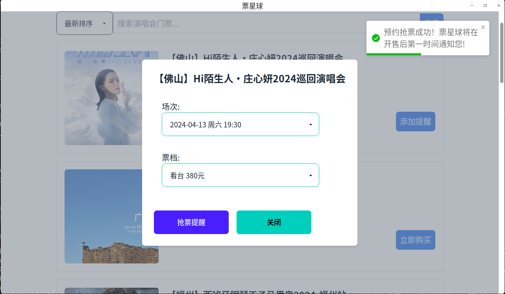

# pxq_ticket

## 简介

基于 Tauri 开发的跨平台票星球客户端，可在 Linux、Windows 和 macOS 等操作系统上使用。

## 功能展示

## 短信登录

- 无图片验证码:

- 有图片验证码:

## 搜索演出

### 按钮说明

- 添加提醒: 官方确定会出售此演出的票, 但是未公布开售时间, 添加提醒之后, 当演唱会公布开售日期后会收到提醒短信。

- 缺票登记: 前提条件演出门票已售完, 点击缺票登记, 在有票之后官方会发送短信通知。

- 加入抢票: 演出公布了售票日期后, 加入任务等待抢票。

- 立即购买: 已开售并且还有剩余票的情况下，可以直接购买。

## TODO

- 购买功能
- 订单列表

